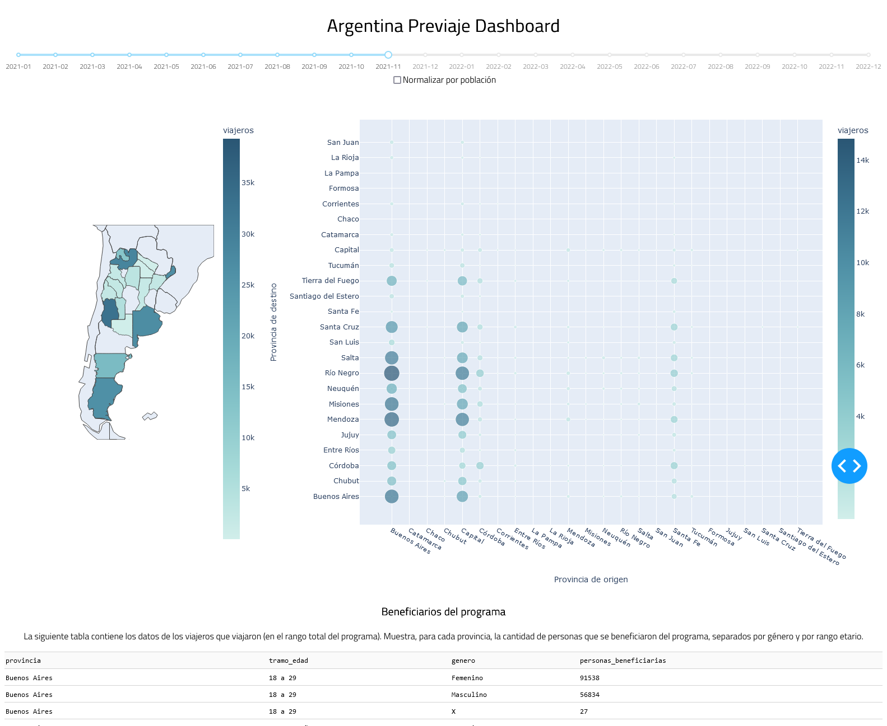

# ArgPreviajeDashboard
Un dashboard sobre el programa previaje implementado en Argentina. Muestra la cantidad de viajeros entre provincias en el periodo de tiempo seleccionado (se divide por meses). Data tomada de https://datos.gob.ar/dataset/turismo-previaje.

